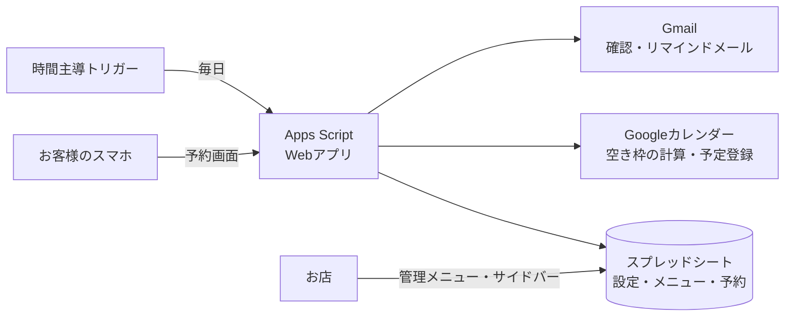

# サロン予約システム

1人で営業する美容サロン・エステ・ネイルサロン向けの、**運用費0円**で使えるWeb予約システムです。
Googleアカウント1つあれば、Googleスプレッドシート・Apps Script・Googleカレンダー・Gmailだけで動きます。サーバーの契約も有料サービスも要りません。

InstagramのプロフィールなどにURLを貼っておけば、お客様は「メニュー → 日時 → 連絡先」の3ステップで予約できます。お店側はスプレッドシートとカレンダーで予約を管理します。

> [!NOTE]
> このリポジトリは紹介用です。製品として導入・販売を予定しているため、ソースコードは非公開にしています。
> コードをご覧になりたい方は、ご連絡いただければ個別にご案内します。

<!--
## スクリーンショット

images/ フォルダに画像を置き、このコメントを外してください。

| 予約画面 | 日時の選択 | 予約完了 |
| --- | --- | --- |
|  |  |  |

| 確認メール | 管理用スプレッドシート | Googleカレンダー |
| --- | --- | --- |
|  |  |  |
-->

## 主な機能

**お客様向け（予約画面）**

- メニュー選択 → カレンダーで空き日時を選択 → 連絡先入力の3ステップ予約（スマホ対応）
- 予約確認メール・前日のリマインドメール
- 予約の確認・キャンセル（メールのリンク、またはメールアドレス＋電話番号で呼び出し）

**お店向け（スプレッドシート）**

- 営業時間・定休日・臨時休業日・休憩時間・予約枠の刻み・施術後の準備時間などをシート上で設定
- 個人のGoogleカレンダーの予定が入っている時間は、自動で予約不可にする
- 「今後の予約」シートで予約の一覧を確認、シート上の操作でお店側からキャンセル
- サイドバーのフォームからメニューを追加
- 新規予約・キャンセルをメールで通知

## 構成



| 使っているもの | 役割 |
| --- | --- |
| Google Apps Script | サーバー側の処理。Webアプリとして公開 |
| HTML / CSS / JavaScript（フレームワークなし） | 予約画面とメニュー追加フォーム |
| Googleスプレッドシート | 設定・メニュー・予約データの保存と管理画面 |
| Googleカレンダー | 予約の登録と、空き枠の計算に使う既存の予定 |
| Gmail（MailApp） | 予約確認・キャンセル・リマインドのメール |
| Node.js | Googleのサービスをまねた環境での自動テスト |

外部のライブラリやパッケージは使っていません。コードは全体で約2,900行です（サーバー側 約1,250行、画面 約760行、テスト 約850行）。

## 工夫した点

### 予約の正しさ

- **二重予約の防止**：`LockService` でロックを取り、ロックの中で空き状況をもう一度確認してから登録します。先にロックの外で軽く確認しておくので、埋まっている枠への送信がロックを長く占有することはありません。
- **途中で失敗したときの後始末**：カレンダーに予定を登録したあと、シートへの書き込みに失敗した場合は予定を削除します。シートとカレンダーの内容がずれません。
- **常に日本時間で計算**：スクリプトのタイムゾーン設定やサーバーの環境に左右されないよう、日付と時刻は日本時間（UTC+9）で計算します。11/31 のような存在しない日付は受け付けません。
- **リマインドの再実行**：ほかの処理がロックを持っていてリマインドを送れないときは、15分後の再実行を予約します（最大3回）。日付をまたいでも、元の日の分を送ります。

### セキュリティ・いたずら対策

- **管理機能は持ち主だけ**：予約画面を開いた人（匿名）から呼べるのは、お客様向けの関数だけです。初期設定やトリガーの設定は、スプレッドシートの持ち主のアカウントでしか実行できません。
- **回数制限**：同じメール・電話番号からの予約は1時間に3件まで、お店全体でも1時間あたりの上限を設けています。上限を超えたら受付を止め、お店に1回だけ知らせます。Gmailの `+tag` やドット付きのアドレスも同じ人として数えます。
- **メール送信枠の確保**：Gmailの1日の送信上限が残り少なくなったらWeb予約を止め、リマインドとお店への通知の分を残します。
- **数式の埋め込み対策**：入力値が `=` `+` `-` `@` で始まる場合は、スプレッドシートで数式として扱われないように保存します。
- **ボット対策**：人には見えない入力欄（ハニーポット）に値が入っていたら受け付けません。
- **クリックジャッキング対策**：設定で許可しない限り、ほかのサイトの枠の中に予約画面を表示させません。
- **エラーの中身を見せない**：想定外のエラーは、お客様には一般的なメッセージだけを表示し、詳しい内容はログに残します。
- **複数のお店に導入するときの安全策**：スプレッドシートをコピーして導入すると、コピー先は初期設定をするまで動きません。コピー元の通知先メール・予約ページURL・カレンダーも引き継ぎません。

### テスト

Apps Script はそのままでは手元のパソコンでテストできません。そこで、スプレッドシート・カレンダー・Gmail・ロック・キャッシュなどのGoogleのサービスをまねるモックを自作しました。本番と同じコードをNode.jsの `vm` で読み込み、**54項目**を自動で確認しています。

```
$ TZ=Asia/Tokyo node test/test.js
...
54 passed, 0 failed
```

<details>
<summary>テスト項目の一覧（54項目）</summary>

**初期設定**

- 初期設定でシート・カレンダー・トリガーが作られる
- 初期設定を2回実行しても設定値・メニュー・カレンダー・トリガーが重複/消えない
- doGet で公開URLが保存される（/dev は保存しない）

**空き枠の計算**

- 営業時間・刻み・所要時間どおりに枠が出る（10:00〜19:00、60分→最終18:00）
- 定休日（火）は枠なし、範囲は今日〜60日先
- 今日は「予約締切3時間前」より前の枠が出ない（今9:00→12:00〜）
- 予約が入ると、重なる枠と準備時間15分ぶんの枠が消える
- 準備時間0なら隣り合う予約がぴったり入る
- 休憩時間・臨時休業日・全角入力が効く
- 予約用カレンダーの終日予定はその日を休みにする／手入力の予定は準備時間なしでブロック
- 個人カレンダーの時間指定予定はブロック、終日予定・欠席予定は無視、「いいえ」で無効

**予約**

- 予約するとカレンダー・シート・メール2通（お客様／お店）
- 同じ枠への2件目は [SLOT] で断られる（二重予約防止）
- 1人あたりの予約上限（2件）
- 入力チェック：電話・メール・同意・ボット・存在しないメニュー・範囲外の日
- 全角の電話番号・メールも受け付ける

**キャンセル・予約の呼び出し**

- お客様キャンセル：予定削除・ステータス更新・枠が空く・メール2通
- キャンセル期限（24時間前）を過ぎるとWebキャンセル不可
- 不正なキャンセルIDは [NOTFOUND]
- お店側キャンセル（シートで行を選んでメニューから）
- 予約の呼び出し：メールと電話番号の両方が一致した今後の予約だけ返す
- 予約の呼び出しは同じメールで10分に10回まで
- 「予約ページURL」を設定すると、メールのリンクはそのURLになる
- 「今後の予約」：予約済み・今日以降だけを日付順に表示し、キャンセルで消える
- 予約シートの日付・時刻が日付として取り込まれても正しく読める
- 電話番号：列の書式が文字列でなくても先頭の0が消えない／消えていた行も読める

**セキュリティ・安全性**

- 予約ページの訪問者（匿名）からは管理用の関数を一切呼べない
- お客様向けの関数は匿名でも使える
- リマインドはこのスクリプトのトリガーからなら匿名扱いでも動く
- 同じメール・電話番号からの予約は1時間に3件まで（上限設定を上げても）
- お店全体の1時間あたり上限を超えると受付停止し、お店に1回だけ知らせる
- メールアドレスが = + - で始まる値は受け付けない（数式の埋め込み対策）
- 想定外のエラーは中身を見せず [ERROR] にし、カレンダーの予定も残さない
- コピー先：初期設定前は動かず、初期設定でコピー元の通知先・URL・カレンダーを引き継がない
- 旧バージョンで設定済みなら、更新後もそのまま動き、通知先メールを上書きしない
- ご要望欄の例文は設定から変えられる
- 存在しない日付（11/31・10/99）は受け付けない
- 埋まった枠・存在しない予約IDへの送信はロックを取らずに断る
- リマインド：ロックが取れないときは15分後に再実行を予約し、お店に知らせる（重複予約しない）
- メールの送信枠が残り少ないときはWeb予約を止める（リマインド用に残す）
- メールの別名（+tag・Gmailのドット）も同じ人として回数を数える
- 編集者は日々の管理機能は使えるが、初期設定・トリガー設定はできない
- カレンダーの一時的なエラーで設定を消さない
- 初期設定前のコピーでは、キャンセル・呼び出しも動かない
- 埋め込みは「はい」のときだけ許可
- リマインドの再実行は最大3回で止まり、日付をまたいでも元の日の分を送る
- メール枠が残り少ないとき、Webキャンセルはメールを送らずに完了する
- リマインドを送れなかった予約があれば、お店に一覧を知らせる

**リマインド**

- 前日のリマインド：翌日分だけ送り、2回目は送らない
- カレンダーから直接消された予約にはリマインドを送らない
- リマインド時刻の変更が反映される

**メニュー管理**

- メニュー追加：空き行に入り、すぐ予約画面に出る／重複・不正は拒否
- シートに手入力したメニュー・非表示チェック
- 初期設定前に開くと [SETUP]

</details>

## 拡張について（LINE公式アカウント連携）

今の版はメールで連絡しますが、LINE公式アカウントとの連携にも対応できます。Messaging API は Apps Script から呼び出せるので、今の構成のまま機能を足せます。

- **リッチメニューに予約ページを置く**：コードを変えずに、今すぐ使えます
- **お店への通知をLINEで受け取る**：新規予約・キャンセルをお店のLINEに知らせます
- **お客様への予約確認・リマインドをLINEで送る**：LIFF（LINE上で動くWebアプリ）でお客様のLINEアカウントと予約を結びつけます
- **LINEの中で予約を完結させる**：LIFFで予約画面をLINEアプリ内に表示します

LINE公式アカウントの無料プランで送れるのは月200通までなので、メールと併用する形を想定しています。

## 導入・お問い合わせ

導入のご相談やコードの閲覧のご希望は、GitHubのプロフィールに記載の連絡先からご連絡ください。

---

© 2026 Kamiya. All rights reserved.
